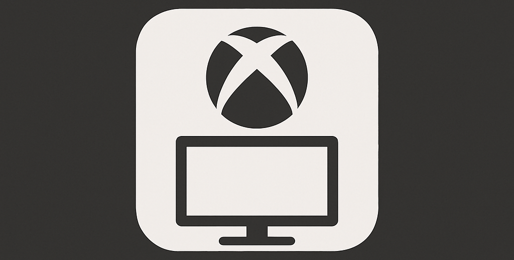

# Xbox 全螢幕體驗工具

<p align="center">

</p>

<p align="center">

</p>

<p align="center">
<a href="https://github.com/8bit2qubit/XboxFullscreenExperienceTool/releases/latest"></a>
<a href="https://github.com/8bit2qubit/XboxFullscreenExperienceTool/releases"></a>
<a href="#"></a>
<a href="https://github.com/8bit2qubit/XboxFullscreenExperienceTool/blob/main/LICENSE"></a>
</p>

一款簡單、安全的一鍵式工具，專為啟用 Windows 11 中隱藏的 Xbox 全螢幕遊戲體驗而生。本工具將繁複的底層設定全部自動化，讓您輕鬆享受專為遊戲手把最佳化的類主機介面。

## ⚠️ **重大警告：請在繼續前閱讀**

使用本工具代表您已閱讀、理解並同意以下所有條款：

*   **高風險操作**：本工具會對您的 Windows 系統進行深層修改。此類操作具有**固有風險**，可能導致系統崩潰、應用程式衝突、資料遺失或需要重灌作業系統。
*   **後果自負**：您同意**完全自行承擔**所有可能發生的正面或負面後果。開發者不對任何形式的損壞提供支援或承擔責任。
*   **無任何保證**：本工具不提供任何穩定性或功能性的保證。它可能在您的特定硬體或軟體配置上無法正常運作。
*   **備份是您的責任**：在執行本工具前，您有責任**備份所有重要資料**並**建立系統還原點**。
*   **非官方工具**：本專案與 Microsoft 或 Xbox 官方無關。

**[➡️ 前往發行頁面下載最新版本](https://github.com/8bit2qubit/XboxFullscreenExperienceTool/releases/latest)**

-----

### ⚠️ 重要前提：系統版本要求

本工具**僅適用於 Windows 11 開發人員預覽版 (Dev Channel) 組建 `26220.6690` 或更新版本**。在不符要求的系統上，工具將提示錯誤並無法執行。請在下載前確認您的作業系統版本。

-----

## ✨ 功能特色

*   **一鍵切換**：提供直觀的介面，只需點選一次即可啟用或停用 Xbox 全螢幕體驗。
*   **自動系統檢查**：啟動時自動驗證您的 Windows 組建版本，確保符合執行要求。
*   **硬體類型模擬**：若您使用桌上型或筆記型電腦，工具會自動將裝置類型模擬為掌機，以滿足啟用條件。
*   **安全且完全可逆**：所有變更都會在停用或解除安裝時被還原。工具會備份初始設定，確保您的系統能無損恢復原狀。
*   **標準化安裝**：提供標準的 `.msi` 安裝檔，便於版本管理與乾淨解除安裝。
*   **全流程自動化**：所有步驟皆由工具自動完成，無需手動介入。

-----

## 🚀 快速入門

1.  從 **[發行頁面](https://github.com/8bit2qubit/XboxFullscreenExperienceTool/releases/latest)** 下載最新的 `.msi` 安裝檔。
2.  執行安裝程式（過程需要系統管理員權限）。
3.  從桌面捷徑啟動工具。
4.  點選 `啟用 Xbox 全螢幕體驗` 按鈕，並**重新啟動**您的電腦。
5.  若要還原，再次執行工具，點選 `停用並還原` 按鈕，並**重新啟動**即可。

-----

## 💻 技術堆疊

*   **執行環境**: .NET 8
*   **核心邏輯**: C#
*   **使用者介面**: Windows Forms (WinForms)
*   **相依函式庫**:
    *   **ViVeLib (ViVeTool)**: 一個用於操控 Windows 功能組態 (Feature Flags) 的原生 API 封裝函式庫。以 Git Submodule 方式整合，原始碼來自 [thebookisclosed/ViVe](https://github.com/thebookisclosed/ViVe)，特此感謝。
    *   **PhysPanelLib**: 封裝 `ntdll.dll` 未公開 API，用以讀寫實體顯示面板 (Physical Panel) 尺寸資訊的函式庫。為本專案自研，其概念參考自 [riverar/physpanel](https://github.com/riverar/physpanel) 的 Rust 實作，特此感謝。
*   **安裝套件**: Visual Studio Installer Projects (MSI)

-----

## 🛠️ 本地開發

若要在您自己的電腦上執行此專案，請遵循以下步驟。

1.  **複製儲存庫**

    ```bash
    git clone https://github.com/8bit2qubit/XboxFullscreenExperienceTool.git
    cd XboxFullscreenExperienceTool
    ```

2.  **初始化子模組**
    本專案使用 Git Submodules 來管理相依套件。

    ```bash
    git submodule update --init --recursive
    ```

3.  **在 Visual Studio 中開啟**
    使用 Visual Studio 開啟 `XboxFullscreenExperienceTool.sln` 方案檔。

4.  **執行以進行開發**
    在 Visual Studio 中，將組建組態設定為 `Debug`，然後按下 `F5` 或點選「開始」按鈕來建置並執行應用程式。

5.  **建置以用於生產**
    當您準備好部署時，將組建組態切換至 `Release` 並建置方案。成品將會生成在 `XboxFullscreenExperienceTool/bin/Release` 目錄下。

-----

## 📄 授權條款

本專案採用 [GNU General Public License v3.0 (GPL-3.0)](https://github.com/8bit2qubit/XboxFullscreenExperienceTool/blob/main/LICENSE) 授權。

這意味著您可以自由地使用、修改與散佈本軟體，但任何基於此專案的衍生作品在散佈時，**也必須採用相同的 GPL-3.0 授權，並提供完整的原始碼**。更多詳情，請參閱 [GPL-3.0 官方條款](https://www.gnu.org/licenses/gpl-3.0.html)。