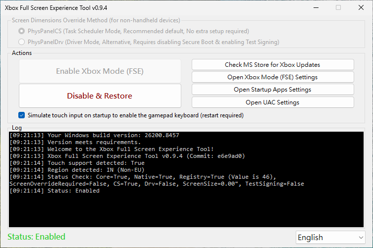

# Xbox Fullscreen Experience Tool

> 🌐 [中文說明 (繁體)](README.zh-TW.md)

<p align="center">

</p>

<p align="center">

</p>

<p align="center">
<a href="https://github.com/8bit2qubit/XboxFullscreenExperienceTool/releases/latest"></a>
<a href="https://github.com/8bit2qubit/XboxFullscreenExperienceTool/releases"></a>
<a href="#"></a>
<a href="https://github.com/8bit2qubit/XboxFullscreenExperienceTool/blob/main/LICENSE"></a>
</p>

A lightweight and secure one-click utility designed to enable **Windows 11’s hidden Xbox fullscreen gaming experience**.
This tool automates all underlying configurations, providing a seamless, console-like interface optimized for gamepads.

## ⚠️ **Warning: Please Read Before Proceeding**

By using this tool, you acknowledge and agree to the following:

* **System Modification** – This tool performs deep modifications to Windows and may cause instability, crashes, data loss, or require OS reinstallation.
* **Use at Your Own Risk** – You are fully responsible for any consequences. The developer provides no warranty, support, or liability for any damages.
* **No Guarantees** – The tool is provided *as is* with no guarantee of stability, compatibility, or functionality. It may not work correctly on your specific configuration.
* **Backup Required** – Always back up your important data and create a system restore point before use.
* **Unofficial Tool** – This project is not affiliated with, endorsed by, or supported by Microsoft or Xbox.

-----

## ⚙️ System Requirements

This tool is **only compatible with Windows 11 Insider Dev Channel builds `26220.6690` or later**.
If your system does not meet this requirement, the tool will display an error and exit.
Please verify your Windows build version before downloading.

**[➡️ Download the Latest Release](https://github.com/8bit2qubit/XboxFullscreenExperienceTool/releases/latest)**

-----

## ❤️ Support This Project

If you find this tool helpful, your support would be a great motivation for me to continue maintaining and developing more open-source projects!

<a href="https://www.patreon.com/cw/u57025610/membership"></a>

-----

## ✨ Features

* **One-Click Toggle** – Simple interface to enable or disable the Xbox fullscreen experience.
* **Automatic System Check** – Verifies your Windows build for compatibility at startup.
* **Device Type Emulation** – Automatically simulates a handheld device type for activation on desktop or laptop systems.
* **Safe and Reversible** – All changes are fully reversible. Backups of original settings are created to ensure safe restoration.
* **Standard Installation** – Distributed as a `.msi` installer for clean installation, management, and removal.
* **Fully Automated Process** – Handles all steps automatically with no manual configuration required.

-----

## 🚀 Quick Start

1. Download the latest `.msi` package from the [**Releases Page**](https://github.com/8bit2qubit/XboxFullscreenExperienceTool/releases/latest).
2. Run the installer (administrator privileges required).
3. Launch the tool from the desktop shortcut.
4. Click **“Enable Xbox Fullscreen Experience”** and **restart your PC**.
5. To revert changes, run the tool again, click **“Disable & Restore”**, and restart.

-----

## 💻 Tech Stack

* **Runtime**: .NET 8
* **Language**: C#
* **UI Framework**: Windows Forms (WinForms)
* **Dependencies**:
  * **ViVeLib (ViVeTool)** – A native API wrapper for managing Windows Feature Flags. Integrated as a Git submodule from [thebookisclosed/ViVe](https://github.com/thebookisclosed/ViVe).
  * **PhysPanelLib** – A custom library for reading and writing physical panel size information via undocumented `ntdll.dll` APIs. Concept adapted from [riverar/physpanel](https://github.com/riverar/physpanel).
* **Installer**: Visual Studio Installer Projects (MSI)

-----

## 🛠️ Local Development

Follow these steps to run this project on your own machine.

1.  **Clone the Repository**

    ```bash
    git clone https://github.com/8bit2qubit/XboxFullscreenExperienceTool.git
    cd XboxFullscreenExperienceTool
    ```

2.  **Initialize Submodules**
    This project uses Git Submodules to manage dependencies.

    ```bash
    git submodule update --init --recursive
    ```

3.  **Open in Visual Studio**
    Open the `XboxFullscreenExperienceTool.sln` solution file with Visual Studio.

4.  **Run for Development**
    In Visual Studio, set the build configuration to `Debug` and press `F5` to build and run the application.

5.  **Build for Production**
    When you are ready to deploy, switch the build configuration to `Release` and build the solution. The output will be generated in the `XboxFullscreenExperienceTool/bin/Release` folder.

-----

## 📄 License

This project is licensed under the [GNU General Public License v3.0 (GPL-3.0)](https://github.com/8bit2qubit/XboxFullscreenExperienceTool/blob/main/LICENSE).

This means you are free to use, modify, and distribute this software, but any derivative works based on this project must also be distributed under the **same GPL-3.0 license and provide the complete source code**. For more details, please see the [official GPL-3.0 terms](https://www.gnu.org/licenses/gpl-3.0.html).