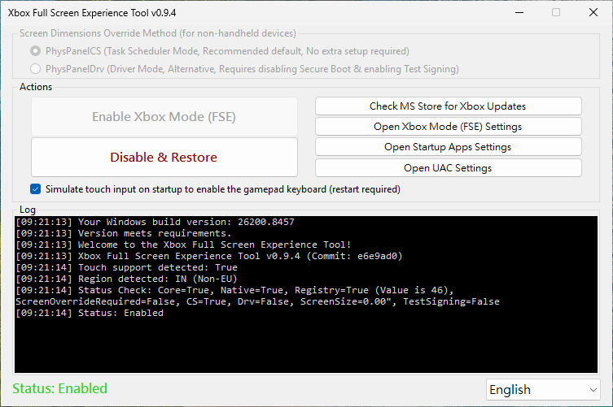

# Xbox Full Screen Experience Tool (Xbox Mode)

> 🌐 **English** | [繁體中文](README.zh-TW.md)

<p align="center">

</p>

<p align="center">

</p>

<p align="center">
<a href="https://github.com/8bit2qubit/XboxFullScreenExperienceTool/releases/latest"></a>
<a href="https://github.com/8bit2qubit/XboxFullScreenExperienceTool/releases"></a>
<a href="#"></a>
<a href="https://github.com/8bit2qubit/XboxFullScreenExperienceTool/blob/main/LICENSE"></a>
</p>

A lightweight and secure one-click utility designed to enable **Windows 11’s hidden Xbox full screen gaming experience** (also known as **"Xbox Mode"** in recent Windows builds).
This tool automates all underlying configurations, providing a seamless, console-like interface optimized for gamepads.

## ⚠️ **Warning: Please Read Before Proceeding**

By using this tool, you acknowledge and agree to the following:

- **System Modification** – This tool performs deep modifications to Windows and may cause instability, crashes, data loss, or require OS reinstallation.
- **Use at Your Own Risk** – You are fully responsible for any consequences. The developer provides no warranty, support, or liability for any damages.
- **No Guarantees** – The tool is provided _as is_ with no guarantee of stability, compatibility, or functionality. It may not work correctly on your specific configuration.
- **Backup Required** – Always back up your important data and create a system restore point before use.
- **Unofficial Tool** – This project is not affiliated with, endorsed by, or supported by Microsoft or Xbox.

---

## 🎮 Full Handheld vs. Limited PC Xbox Mode

Microsoft has recently rolled out a **limited PC edition** of Xbox Mode (Full Screen Experience) to regular PCs. This edition is **missing key features** required for a true console-like experience:

| Feature | Full Handheld Xbox Mode | Limited PC Xbox Mode |
|---|---|---|
| `Choose home app` setting | ✅ Available | ❌ Missing |
| Auto-launch home app on startup | ✅ Supported | ❌ Not supported |
| Default rollout target | Handhelds | Regular PCs |

This tool's purpose is to enable the **Full Handheld** edition on any PC, unlocking the home-app selection and auto-launch behavior that the Limited PC edition lacks.

> 💡 If you use a custom home app such as **[OmniConsole](https://8bit2qubit.github.io/omniconsole-site/)**, the Full Handheld edition is required.

---

## 💡 Screen Dimensions Override for Desktop PCs & Laptops

The Xbox Full Screen Experience (Xbox Mode) is designed for handheld-sized screens. If your device is not a handheld, a screen dimensions override is required. This tool offers two distinct methods, and now automatically guides you to the appropriate choice based on your device type.

### Task Scheduler Mode: `PhysPanelCS` (Recommended)

This is the **default and recommended** method. It is easy to use, requires no additional manual setup, and provides high reliability for all devices, including desktops and laptops.

### Driver Mode: `PhysPanelDrv` (Alternative)

This is an **alternative advanced mode** that uses a custom kernel driver to apply the override at the earliest stage of system boot. This method is an option for users who may still encounter issues with the default `PhysPanelCS` mode, but it **requires disabling Secure Boot** and **enabling Test Signing** (see prerequisites below).

### Which Mode Should You Use?

- **For Desktops & Laptops**: Start with **`PhysPanelCS`**. This is the recommended, safest, and most reliable method for most users. If you experience any issues with this default mode, **`PhysPanelDrv`** is available as a fallback alternative (requires the prerequisites listed below).
- **For Handheld Devices**: Your device does not require `PhysPanelCS` or `PhysPanelDrv`. The mode selection UI will be automatically disabled.

> #### **Prerequisites for `PhysPanelDrv` Mode (Alternative)**
>
> ⚠️ **Important:** These steps are only necessary for **desktop and laptop users** who choose to use the alternative `PhysPanelDrv` mode.
>
> Installing this **test-signed driver** requires you to manually disable Secure Boot and enable Windows Test Signing Mode.
>
> **Step 1: Enter BIOS/UEFI Settings**
>
> 1.  Restart your computer and press the designated key during boot (usually `Del`, `F2`, `F10`, or `Esc`) to enter the BIOS/UEFI setup.
> 2.  Find and **disable** the **Secure Boot** option.
> 3.  Save your changes and exit.
>
> **Step 2: Enable Test Signing in Windows**
>
> 1.  Once your computer has restarted into Windows, open Terminal (PowerShell or Command Prompt) **as an administrator**.
> 2.  Enter the following command and press Enter:
>     ```
>     bcdedit /set testsigning on
>     ```
> 3.  Restart your computer one more time to apply the change.
>
> After completing these steps, you can select **`PhysPanelDrv`** in the tool.

---

## ⚙️ System Requirements

This tool is compatible with **Windows 11 24H2 builds `26100.7019` or later**. If your system does not meet this requirement, the tool will display an error and exit.

> ### **How to Read Build Numbers (Important!)**
>
> When checking the version, **please look at the main build number (before the dot)**. The number _after_ the dot is just a minor update revision.
>
> ### **Native Experience (Recommended)**
>
> _Native support. For Desktops & Laptops, does not rely on screen dimensions override via PhysPanelCS / PhysPanelDrv._
>
> - `26100.8328` or later
> - `26200.8328` or later
> - `26220.7271` or later
> - `26300.7674` or later
> - `28020.1362` or later
>
> ### **Legacy Experience**
>
> - `26100.7019` ~ `26100.8327`
> - `26200.7015` ~ `26200.8327`
> - `28000.1450` or later
>
> **Example:** A build like `26100.1` is **NOT** compatible because its revision `.1` is lower than the required `.7019`. If you are on build 26100 / 26200, please run Windows Update to get the latest version.

Please verify your Windows build version before downloading.

**[➡️ Download the Latest Release](https://github.com/8bit2qubit/XboxFullScreenExperienceTool/releases/latest)**

---

## ✨ Features

- **One-Click Toggle** – Simple interface to enable or disable the Xbox full screen experience (Xbox mode).
- **Automatic System Check** – Verifies your Windows build for compatibility at startup.
- **Automatic Gamepad Keyboard Fix & Touch Simulation** – Simulates touch input at system startup to ensure the on-screen keyboard (including the PIN pad on the login screen) is always ready and accessible via gamepad on non-touch PCs.
- **Device Type Emulation** – Automatically simulates a handheld device type for activation on desktop or laptop systems.
- **Convenience Shortcuts** – Dedicated buttons to quickly access **MS Store Updates**, **Full Screen Experience Settings**, **Startup Apps**, and **UAC Settings**.
- **Automatic Mode Selection** – Detects your device type (Desktop, Laptop, Handheld) and provides the appropriate screen dimension override options.
- **Safe and Reversible** – All changes are fully reversible. Backups of original settings are created to ensure safe restoration.
- **Standard Installation** – Distributed as a `.msi` installer for clean installation, management, and removal.

---

## 🚀 Quick Start

This process consists of preparing your system with the tool, updating apps, and finally enabling the feature in Windows Settings.

### 1. Prepare Your System

1.  Download the latest `.msi` package from the [**Releases Page**](https://github.com/8bit2qubit/XboxFullScreenExperienceTool/releases/latest).
2.  Run the installer (administrator privileges required).
3.  Launch the tool from the desktop shortcut. If using a desktop PC or laptop, the tool will automatically select the recommended **`PhysPanelCS`** mode.
    > **Note:** If you are a **desktop or laptop user** and wish to use the alternative **`PhysPanelDrv`** mode, you can select it manually. Ensure you have completed the prerequisites listed above first.
4.  Click the **“Enable Xbox Full Screen Experience”** button.
5.  Accept the system restart confirmation prompt.
6.  The tool will verify your environment. If no physical touch screen is detected, you will be prompted to select "Yes" to enable touch simulation. This ensures you can use your controller to operate the on-screen virtual keyboard (Gamepad Keyboard) properly. **Your PC will restart automatically** to apply all changes.

### 2. Update Core Apps

1.  After restarting, launch the tool again.
2.  Click the **"Check MS Store for Xbox Updates"** button (or manually open Microsoft Store > **Downloads** or **Library**).
3.  Click **"Check for updates"** within the Store to refresh all apps. Make sure **Xbox** and **Xbox Game Bar** are fully updated.
    > 🔄 **Tip:** You may need to run "Check for updates" **twice** to ensure everything is fully installed.

### 3. Activate Full Screen Experience / Xbox Mode

1.  Click the **"Open Full Screen Experience Settings"** button in the tool (or navigate to **Start → Settings → Gaming → Full screen experience / Xbox mode**).
2.  Set "Choose Home app" to **Xbox**.
    - If this option is missing, return to "Update Core Apps" and ensure the apps are fully updated.
3.  Enable **"Enter full screen experience on startup" / "Enter Xbox mode on startup"**.

### **How to Revert**

1.  Run the tool again and click **“Disable & Restore”**.
2.  **Restart your PC** to complete the process.

---

## 💻 Tech Stack

- **Primary Stack**: C# & .NET 8
- **UI Framework**: Windows Forms (WinForms)
- **Supporting Languages**: C++, C, PowerShell
- **Components & Libraries**:
  - **ViVeLib (ViVeTool)** – A native API wrapper for managing Windows Feature Flags. Integrated as a Git submodule from [thebookisclosed/ViVe](https://github.com/thebookisclosed/ViVe).
  - **PhysPanelLib** – A custom library for reading and writing physical panel dimensions via undocumented `ntdll.dll` APIs. Concept adapted from [riverar/physpanel](https://github.com/riverar/physpanel).
  - **PhysPanelDrv** – A lightweight kernel driver for the advanced `PhysPanelDrv` mode that reliably overrides physical display dimensions. Integrated as a Git submodule from [8bit2qubit/PhysPanelDrv](https://github.com/8bit2qubit/PhysPanelDrv).
- **Installer**: Visual Studio Installer Projects (MSI)

---

## 🙏 Acknowledgements

This project was made possible by these incredible open-source tools:

- **[ViVeTool](https://github.com/thebookisclosed/ViVe)** by **@thebookisclosed**
- **[physpanel](https://github.com/riverar/physpanel)** by **@riverar**

A huge thank you for their contributions to the community.

---

## 🛠️ Local Development

Follow these steps to run this project on your own machine.

1.  **Clone the Repository**

    ```bash
    git clone https://github.com/8bit2qubit/XboxFullScreenExperienceTool.git
    cd XboxFullScreenExperienceTool
    ```

2.  **Initialize Submodules**
    This project uses Git Submodules to manage dependencies.

    ```bash
    git submodule update --init --recursive
    ```

3.  **Open in Visual Studio**
    Open the `XboxFullScreenExperienceTool.sln` solution file with Visual Studio.

4.  **Run for Development**
    In Visual Studio, set the build configuration to `Debug` and press `F5` to build and run the application.

5.  **Build for Production**
    When you are ready to deploy, switch the build configuration to `Release` and build the solution. The output will be generated in the `XboxFullScreenExperienceTool/bin/Release` folder.

---

## 🌟 Star History

<a href="https://star-history.com/#8bit2qubit/XboxFullScreenExperienceTool&Date">
  <picture>
    <source media="(prefers-color-scheme: dark)" srcset="https://api.star-history.com/svg?repos=8bit2qubit/XboxFullScreenExperienceTool&type=Date&theme=dark" />
    <source media="(prefers-color-scheme: light)" srcset="https://api.star-history.com/svg?repos=8bit2qubit/XboxFullScreenExperienceTool&type=Date" />
    
  </picture>
</a>

---

## 📄 License

This project is licensed under the [GNU General Public License v3.0 (GPL-3.0)](https://github.com/8bit2qubit/XboxFullScreenExperienceTool/blob/main/LICENSE).

This means you are free to use, modify, and distribute this software, but any derivative works based on this project must also be distributed under the **same GPL-3.0 license and provide the complete source code**. For more details, please see the [official GPL-3.0 terms](https://www.gnu.org/licenses/gpl-3.0.html).
