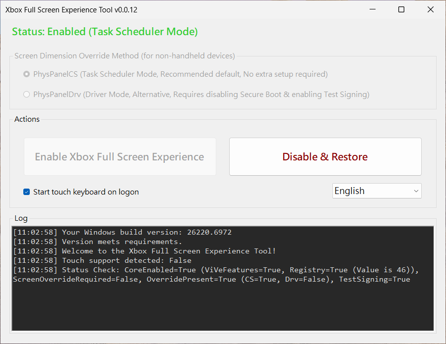

# Xbox Full Screen Experience Tool

> 🌐 **English** | [繁體中文](README.zh-TW.md)

<p align="center">

</p>

<p align="center">

</p>

<p align="center">
<a href="https://github.com/8bit2qubit/XboxFullScreenExperienceTool/releases/latest"></a>
<a href="https://github.com/8bit2qubit/XboxFullScreenExperienceTool/releases"></a>
<a href="#"></a>
<a href="https://github.com/8bit2qubit/XboxFullScreenExperienceTool/blob/main/LICENSE"></a>
</p>

A lightweight and secure one-click utility designed to enable **Windows 11’s hidden Xbox full screen gaming experience**.
This tool automates all underlying configurations, providing a seamless, console-like interface optimized for gamepads.

## ⚠️ **Warning: Please Read Before Proceeding**

By using this tool, you acknowledge and agree to the following:

* **System Modification** – This tool performs deep modifications to Windows and may cause instability, crashes, data loss, or require OS reinstallation.
* **Use at Your Own Risk** – You are fully responsible for any consequences. The developer provides no warranty, support, or liability for any damages.
* **No Guarantees** – The tool is provided *as is* with no guarantee of stability, compatibility, or functionality. It may not work correctly on your specific configuration.
* **Backup Required** – Always back up your important data and create a system restore point before use.
* **Unofficial Tool** – This project is not affiliated with, endorsed by, or supported by Microsoft or Xbox.

-----

## 💡 Future Plans & Technical Challenges

### The Challenge: Perfecting the Experience on Non-Handhelds

The Xbox Full Screen feature works best on small, handheld-sized screens. To enable it on other hardware, a screen size override is necessary. This is crucial for two main user groups: **desktop PCs**, which typically report undefined (0x0) physical dimensions, and **laptops**, whose screens are almost always larger than the 9.5-inch handheld threshold.

The current method uses a Task Scheduler to apply this override at boot, simulating a 7-inch screen, but this creates a race condition. On a system with a fast SSD, if you log in quickly, especially using Windows Hello, the Windows Shell will initialize before the override is applied. As a result, the Shell starts with the default screen settings and fails to launch the special Xbox interface for that session.

### The Robust Solution vs. The Technical Barrier

The definitive solution is a kernel driver, [`PhysPanelDrv`](https://github.com/8bit2qubit/PhysPanelDrv), which applies the screen size override at the earliest stage of system boot. This completely eliminates the race condition for desktops and laptops. For this driver to be trusted by Windows, it must pass Microsoft's driver attestation process. This requires a high-trust EV Code Signing Certificate just to submit, presenting a significant technical hurdle for an independent developer. **This means `PhysPanelDrv` currently exists as a proof-of-concept rather than a publicly distributable solution.**

-----

## ⚙️ System Requirements

This tool is **only compatible with Windows 11 Insider Dev Channel builds `26220.6690` or later**.
If your system does not meet this requirement, the tool will display an error and exit.

> ### **How to Read Build Numbers (Important!)**
>
> When checking the version, **please look at the main build number (before the dot)**. The number *after* the dot is just a minor update revision.
>
> * **INCOMPATIBLE:** `26100.xxxx` (Release Build 24H2)
> * **INCOMPATIBLE:** `26200.xxxx` (Release Build 25H2)
> * **COMPATIBLE:** `26220.6690` or later (Dev Build 25H2)
>
> **Example:** A build like `26200.6899` is **NOT** compatible because its main build **26200** is lower (older) than the required **26220**.

> ### **Why is the Dev Channel Required? (Please Read)**
>
> This is a common question. While the Xbox full screen feature is present in other builds (like Release 25H2, `26200.xxxx`), the decision to support the **Dev Channel** is strictly for quality and stability.
>
> * **Known Bugs:** Non-Dev builds suffer from bugs that create a poor user experience. This includes:
>     * Instability with the **Task View**.
>     * Issues when **closing applications** (e.g., with the 'X' button).
>     * An exceptionally poor experience in `26200` builds prior to the `.6899` update.
>
> The Dev Channel offers a far more stable and mature implementation. Support for other channels will be considered if these issues are resolved in future public builds.

For a detailed walkthrough on joining the Windows Insider Program and upgrading to the correct build, refer to the following guide:
* **[English Guide](https://github.com/8bit2qubit/xbox-fullscreen-experience-guide/blob/main/README.md)**
* **[Traditional Chinese Guide (繁體中文指南)](https://github.com/8bit2qubit/xbox-fullscreen-experience-guide/blob/main/README.zh-TW.md)**
* **[Simplified Chinese Guide (简体中文指南)](https://github.com/8bit2qubit/xbox-fullscreen-experience-guide/blob/main/README.zh-CN.md)**

Please verify your Windows build version before downloading.

**[➡️ Download the Latest Release](https://github.com/8bit2qubit/XboxFullScreenExperienceTool/releases/latest)**

-----

## ❤️ Support This Project

If you find this tool helpful, your support would be a great motivation for me to continue maintaining and developing more open-source projects!

<a href="https://www.patreon.com/cw/u57025610/membership"></a>

-----

## ✨ Features

* **One-Click Toggle** – Simple interface to enable or disable the Xbox full screen experience.
* **Automatic System Check** – Verifies your Windows build for compatibility at startup.
* **Device Type Emulation** – Automatically simulates a handheld device type for activation on desktop or laptop systems.
* **Safe and Reversible** – All changes are fully reversible. Backups of original settings are created to ensure safe restoration.
* **Standard Installation** – Distributed as a `.msi` installer for clean installation, management, and removal.
* **Fully Automated Process** – Handles all steps automatically with no manual configuration required.

-----

## 🚀 Quick Start

This tool prepares your system for the new mode. Final activation is done in Windows Settings after following these steps.

### 1. Prepare Your System
1.  Download the latest `.msi` package from the [**Releases Page**](https://github.com/8bit2qubit/XboxFullScreenExperienceTool/releases/latest).
2.  Run the installer (administrator privileges required).
3.  Launch the tool from the desktop shortcut and click **“Enable Xbox Full Screen Experience”**.
4.  **Restart your PC** for the changes to take effect.

### 2. Update Core Apps
1.  After restarting, open the **Microsoft Store**.
2.  Go to the **Downloads** section (or **Library** in older versions of the Store).
3.  Click **"Check for updates"** to refresh all apps. Make sure **Xbox** and **Xbox Game Bar** are fully updated.
    > 🔄 **Tip:** You may need to run "Check for updates" **twice** to ensure everything is fully installed.

### 3. Activate Full Screen Experience
1.  Navigate to **Start → Settings → Gaming → Full screen experience**.
2.  Set "Choose Home app" to **Xbox**.
    - If this option is missing, return to the previous step and ensure the apps are fully updated.
3.  Enable **"Enter full screen experience on startup"**.

### **How to Revert**
1.  Run the tool again and click **“Disable & Restore”**.
2.  **Restart your PC** to complete the process.

-----

## 💻 Tech Stack

* **Runtime**: .NET 8
* **Language**: C#
* **UI Framework**: Windows Forms (WinForms)
* **Dependencies**:
  * **ViVeLib (ViVeTool)** – A native API wrapper for managing Windows Feature Flags. Integrated as a Git submodule from [thebookisclosed/ViVe](https://github.com/thebookisclosed/ViVe).
  * **PhysPanelLib** – A custom library for reading and writing physical panel size information via undocumented `ntdll.dll` APIs. Concept adapted from [riverar/physpanel](https://github.com/riverar/physpanel).
* **Installer**: Visual Studio Installer Projects (MSI)

-----

## 🙏 Acknowledgements

This project was made possible by these incredible open-source tools:

* **[ViVeTool](https://github.com/thebookisclosed/ViVe)** by **@thebookisclosed**
* **[physpanel](https://github.com/riverar/physpanel)** by **@riverar**

A huge thank you for their contributions to the community.

-----

## 🛠️ Local Development

Follow these steps to run this project on your own machine.

1.  **Clone the Repository**

    ```bash
    git clone https://github.com/8bit2qubit/XboxFullScreenExperienceTool.git
    cd XboxFullScreenExperienceTool
    ```

2.  **Initialize Submodules**
    This project uses Git Submodules to manage dependencies.

    ```bash
    git submodule update --init --recursive
    ```

3.  **Open in Visual Studio**
    Open the `XboxFullScreenExperienceTool.sln` solution file with Visual Studio.

4.  **Run for Development**
    In Visual Studio, set the build configuration to `Debug` and press `F5` to build and run the application.

5.  **Build for Production**
    When you are ready to deploy, switch the build configuration to `Release` and build the solution. The output will be generated in the `XboxFullScreenExperienceTool/bin/Release` folder.

-----

## 📄 License

This project is licensed under the [GNU General Public License v3.0 (GPL-3.0)](https://github.com/8bit2qubit/XboxFullScreenExperienceTool/blob/main/LICENSE).

This means you are free to use, modify, and distribute this software, but any derivative works based on this project must also be distributed under the **same GPL-3.0 license and provide the complete source code**. For more details, please see the [official GPL-3.0 terms](https://www.gnu.org/licenses/gpl-3.0.html).