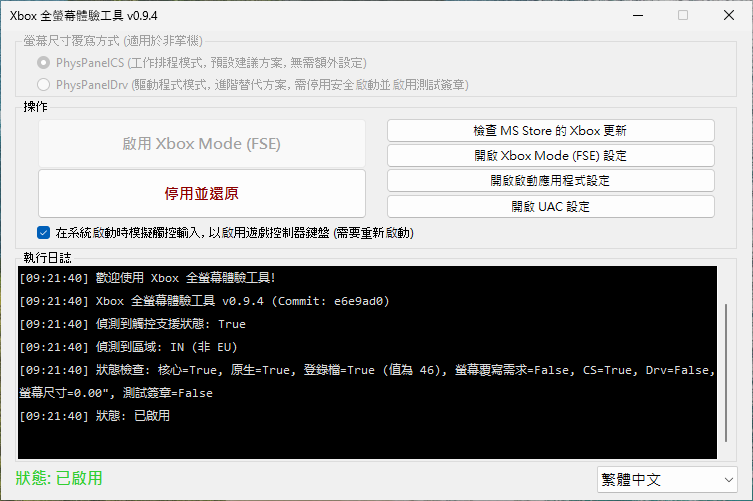

# Xbox 全螢幕體驗工具 (Xbox 模式)

> 🌐 [English](README.md) | **繁體中文**

<p align="center">

</p>

<p align="center">

</p>

<p align="center">
<a href="https://github.com/8bit2qubit/XboxFullScreenExperienceTool/releases/latest"></a>
<a href="https://github.com/8bit2qubit/XboxFullScreenExperienceTool/releases"></a>
<a href="#"></a>
<a href="https://github.com/8bit2qubit/XboxFullScreenExperienceTool/blob/main/LICENSE"></a>
</p>

一款簡單、安全的一鍵式工具，專為啟用 Windows 11 中隱藏的 **Xbox 全螢幕遊戲體驗**（在較新版本中亦稱為「**Xbox 模式**」）而生。本工具將繁複的底層設定全部自動化，讓您輕鬆享受專為遊戲手把最佳化的類主機介面。

## ⚠️ **重大警告：請在繼續前閱讀**

使用本工具代表您已閱讀、理解並同意以下所有條款：

- **高風險操作**：本工具會對您的 Windows 系統進行深層修改。此類操作具有**固有風險**，可能導致系統崩潰、應用程式衝突、資料遺失或需要重灌作業系統。
- **後果自負**：您同意**完全自行承擔**所有可能發生的正面或負面後果。開發者不對任何形式的損壞提供支援或承擔責任。
- **無任何保證**：本工具不提供任何穩定性或功能性的保證。它可能在您的特定硬體或軟體配置上無法正常運作。
- **備份是您的責任**：在執行本工具前，您有責任**備份所有重要資料**並**建立系統還原點**。
- **非官方工具**：本專案與 Microsoft 或 Xbox 官方無關。

---

## 🎮 掌機完整版 vs. PC 限制版 Xbox 模式

微軟近期將 **PC 限制版**的 Xbox 模式 (全螢幕體驗) 推送給一般 PC。此版本**缺少**真正類主機體驗所需的關鍵功能：

| 功能 | 掌機完整版 Xbox 模式 | PC 限制版 Xbox 模式 |
|---|---|---|
| `選擇主畫面應用程式` 設定 | ✅ 有 | ❌ 沒有 |
| 開機自動啟動主畫面應用程式 | ✅ 支援 | ❌ 不支援 |
| 預設推送對象 | 掌機 | 一般 PC |

本工具的用途，正是讓任何 PC 都能啟用**掌機完整版**，解鎖 PC 限制版所缺少的「選擇主畫面應用程式」與開機自動啟動功能。

> 💡 若您使用自訂的主畫面應用程式（例如 **[OmniConsole](https://8bit2qubit.github.io/omniconsole-site/zh-TW/)**），則必須啟用掌機完整版。
>
> 🚀 **OmniConsole** 開機直達任何遊戲平台 — Steam Big Picture、Xbox、Epic、Armoury Crate SE、Playnite，或任何您要加入的平台。

---

## ⚙️ 系統版本要求

本工具適用於 **Windows 11 24H2 組建版本 `26100.7019` 或更新版本**。在不符要求的系統上，工具將提示錯誤並無法執行。

> ### **如何判讀版本號 (非常重要！)**
>
> 當檢查版本時，**請務必查看小數點前的「主要版本號」**。小數點後的數字僅代表次要更新。
>
> ### **Native 體驗 (建議)**
>
> _原生支援。針對桌機與筆電，不依賴 PhysPanelCS / PhysPanelDrv 覆寫螢幕尺寸。_
>
> - `26100.8328` 或更新版本
> - `26200.8328` 或更新版本
> - `26220.7271` 或更新版本
> - `26300.7674` 或更新版本
> - `28020.1362` 或更新版本
>
> ### **Legacy 體驗**
>
> - `26100.7019` ~ `26100.8327`
> - `26200.7015` ~ `26200.8327`
> - `28000.1450` 或更新版本
>
> **範例：** `26100.1` 這樣的版本是**不相容**的，因為它的次要版本號 `.1` 小於 (舊於) 所要求的 `.7019`。如果您處於 26100 / 26200 版本，請執行 Windows Update 以更新至最新狀態。
>
> 📜 在 Legacy 版本上，桌機與筆電會啟用螢幕尺寸覆寫機制 — 詳見 [向下相容（Legacy Builds）](#-向下相容legacy-builds)。

請在下載前確認您的作業系統版本。

**[➡️ 前往發行頁面下載最新版本](https://github.com/8bit2qubit/XboxFullScreenExperienceTool/releases/latest)**

---

## ✨ 功能特色

- **一鍵切換**：提供直觀的介面，只需點選一次即可啟用或停用全螢幕體驗工具 (Xbox 模式)。
- **自動系統檢查**：啟動時自動驗證您的 Windows 組建版本，確保符合執行要求。
- **自動遊戲控制器鍵盤修正與觸控模擬**：在系統啟動時模擬觸控輸入，確保螢幕鍵盤隨時待命，讓非觸控電腦（包含登入畫面的 PIN 面板）也能透過控制器無縫喚起與操作。
- **硬體類型模擬**：若您使用桌上型或筆記型電腦，工具會自動將裝置類型模擬為掌機，以滿足啟用條件。
- **便利捷徑**：提供專屬按鈕以快速存取 **MS Store 更新**、**Xbox Mode (FSE) 設定**、**啟動應用程式**以及 **UAC 設定**。
- **自動模式選擇**：自動偵測您的裝置類型（桌機、筆電、掌機），並提供最適當的螢幕尺寸覆寫選項。
- **安全且完全可逆**：所有變更都會在停用或解除安裝時被還原。工具會備份初始設定，確保您的系統能無損恢復原狀。
- **標準化安裝**：提供標準的 `.msi` 安裝檔，便於版本管理與乾淨解除安裝。

---

## 🚀 快速入門

此流程包含：使用本工具準備系統環境、更新應用程式，最後在 Windows 設定中啟用功能。

### 1. 準備您的系統

1.  從 **[發行頁面](https://github.com/8bit2qubit/XboxFullScreenExperienceTool/releases/latest)** 下載最新的 `.msi` 安裝檔。
2.  執行安裝程式（過程需要系統管理員權限）。
3.  從桌面捷徑啟動工具。
4.  點選 **「啟用 Xbox Mode (FSE)」** 按鈕。
5.  在彈出的系統重啟對話方塊中選擇「是」。
6.  工具會自動偵測運作環境。若未偵測到實體觸控螢幕，建議在詢問是否啟用觸控模擬的視窗中選擇「是」，以確保能用控制器正常操作螢幕虛擬鍵盤（遊戲控制器）。完成後**系統將會自動重新啟動**並套用變更。

### 2. 更新核心應用程式

1.  電腦重啟後，再次開啟本工具。
2.  點選 **「檢查 MS Store 的 Xbox 更新」** 按鈕 (或手動開啟 Microsoft Store > **「下載」** 或 **「媒體櫃」**)。
3.  點選 **「檢查更新」** 來重新整理所有應用程式。請確保 **Xbox** 與 **Xbox Game Bar** 都已更新至最新版本。
    > 🔄 **提示：** 您可能需要點選「檢查更新」**兩次**，才能確保所有項目都安裝完整。

### 3. 啟用全螢幕體驗 / Xbox 模式

1.  點選工具中的 **「開啟 Xbox Mode (FSE) 設定」** (或手動前往 **開始 → 設定 → 遊戲 → 啟用全螢幕體驗 / Xbox 模式**)。
2.  在「選擇主畫面應用程式」中設定為 **Xbox**。
    - 若沒有出現此選項，請返回 "更新核心應用程式" 步驟，確保應用程式都已更新至最新。
3.  啟用 **「啟動時進入啟用全螢幕體驗 / Xbox 模式」**。

### 4. 進入 Xbox 模式 (FSE)

啟用後，您可以透過以下三種方式進入 Xbox 模式 (FSE)：

1.  **手動進入** – 開啟工作檢視，點選 **Xbox 模式 (FSE)**。
2.  **開機進入** – 直接以 Xbox 模式啟動（需在上方步驟 3 啟用「啟動時進入啟用全螢幕體驗 / Xbox 模式」）。
3.  **從 Xbox App 進入** – 開啟 Xbox 應用程式，點選 **Xbox 模式 (FSE)** 入口。

### **如何還原**

1.  再次執行工具，並點選 `停用並還原` 按鈕。
2.  **重新啟動**您的電腦即可完成還原。

> 💡 若要完全移除本工具，請至 **Windows 設定 → 應用程式 → 已安裝的應用程式** 解除安裝。解除安裝程式會還原啟用 Xbox 模式時對系統做的所有變更，並將功能 ID 還原為 Microsoft 管理的預設狀態。

---

## 📜 向下相容（Legacy Builds）

在 Legacy 版本（`26100.7019` ~ `26100.8327` / `26200.7015` ~ `26200.8327`）上，本工具為桌機與筆電提供兩種螢幕尺寸覆寫模式 — `PhysPanelCS`（預設）與 `PhysPanelDrv`（替代方案）。

📖 [了解兩種覆寫模式](Docs/screen-dimensions-override.zh-TW.md)

---

## 💻 技術堆疊

- **主要技術堆疊**: C# & .NET 8
- **使用者介面**: Windows Forms (WinForms)
- **輔助語言**: C++, C, PowerShell
- **元件與函式庫**:
  - **ViVeLib (ViVeTool)**: 一個用於操控 Windows 功能組態 (Feature Flags) 的原生 API 封裝函式庫。以 Git Submodule 方式整合，原始碼來自 [thebookisclosed/ViVe](https://github.com/thebookisclosed/ViVe)，特此感謝。
  - **PhysPanelLib**: 封裝 `ntdll.dll` 未公開 API，用以讀寫實體顯示面板 (Physical Panel) 尺寸資訊的函式庫。為本專案自研，其概念參考自 [riverar/physpanel](https://github.com/riverar/physpanel) 的 Rust 實作，特此感謝。
  - **PhysPanelDrv**: 一個用於進階「驅動程式模式」的輕量級核心驅動程式，能可靠地覆寫實體顯示面板尺寸。以 Git Submodule 方式整合，原始碼來自 [8bit2qubit/PhysPanelDrv](https://github.com/8bit2qubit/PhysPanelDrv)。
- **安裝套件**: Visual Studio Installer Projects (MSI)

---

## 🙏 致謝

這個專案的實現，歸功於以下這些出色的開源工具：

- **[ViVeTool](https://github.com/thebookisclosed/ViVe)** by **@thebookisclosed**
- **[physpanel](https://github.com/riverar/physpanel)** by **@riverar**

由衷感謝他們對社群的貢獻。

---

## 🛠️ 本地開發

若要在您自己的電腦上執行此專案，請遵循以下步驟。

1.  **複製儲存庫**

    ```bash
    git clone https://github.com/8bit2qubit/XboxFullScreenExperienceTool.git
    cd XboxFullScreenExperienceTool
    ```

2.  **初始化子模組**
    本專案使用 Git Submodules 來管理相依套件。

    ```bash
    git submodule update --init --recursive
    ```

3.  **在 Visual Studio 中開啟**
    使用 Visual Studio 開啟 `XboxFullScreenExperienceTool.sln` 方案檔。

4.  **執行以進行開發**
    在 Visual Studio 中，將組建組態設定為 `Debug`，然後按下 `F5` 來建置並執行應用程式。

5.  **建置以用於生產**
    當您準備好部署時，將組建組態切換至 `Release` 並建置方案。成品將會生成在 `XboxFullScreenExperienceTool/bin/Release` 資料夾下。

---

## 🌟 星標歷史紀錄 (Star History)

<a href="https://star-history.com/#8bit2qubit/XboxFullScreenExperienceTool&Date">
  <picture>
    <source media="(prefers-color-scheme: dark)" srcset="https://api.star-history.com/svg?repos=8bit2qubit/XboxFullScreenExperienceTool&type=Date&theme=dark" />
    <source media="(prefers-color-scheme: light)" srcset="https://api.star-history.com/svg?repos=8bit2qubit/XboxFullScreenExperienceTool&type=Date" />
    
  </picture>
</a>

---

## 📄 授權條款

本專案採用 [GNU General Public License v3.0 (GPL-3.0)](https://github.com/8bit2qubit/XboxFullScreenExperienceTool/blob/main/LICENSE) 授權。

這意味著您可以自由地使用、修改與散佈本軟體，但任何基於此專案的衍生作品在散佈時，**也必須採用相同的 GPL-3.0 授權，並提供完整的原始碼**。更多詳情，請參閱 [GPL-3.0 官方條款](https://www.gnu.org/licenses/gpl-3.0.html)。
