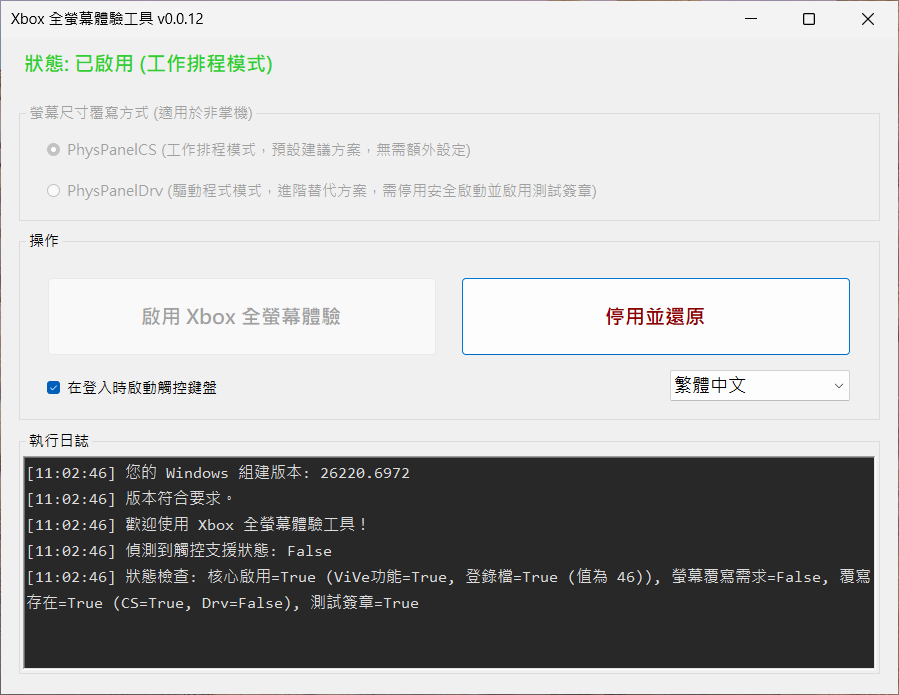

# Xbox 全螢幕體驗工具

> 🌐 [English](README.md) | **繁體中文**

<p align="center">

</p>

<p align="center">

</p>

<p align="center">
<a href="https://github.com/8bit2qubit/XboxFullScreenExperienceTool/releases/latest"></a>
<a href="https://github.com/8bit2qubit/XboxFullScreenExperienceTool/releases"></a>
<a href="#"></a>
<a href="https://github.com/8bit2qubit/XboxFullScreenExperienceTool/blob/main/LICENSE"></a>
</p>

一款簡單、安全的一鍵式工具，專為啟用 Windows 11 中隱藏的 Xbox 全螢幕遊戲體驗而生。本工具將繁複的底層設定全部自動化，讓您輕鬆享受專為遊戲手把最佳化的類主機介面。

## ⚠️ **重大警告：請在繼續前閱讀**

使用本工具代表您已閱讀、理解並同意以下所有條款：

*   **高風險操作**：本工具會對您的 Windows 系統進行深層修改。此類操作具有**固有風險**，可能導致系統崩潰、應用程式衝突、資料遺失或需要重灌作業系統。
*   **後果自負**：您同意**完全自行承擔**所有可能發生的正面或負面後果。開發者不對任何形式的損壞提供支援或承擔責任。
*   **無任何保證**：本工具不提供任何穩定性或功能性的保證。它可能在您的特定硬體或軟體配置上無法正常運作。
*   **備份是您的責任**：在執行本工具前，您有責任**備份所有重要資料**並**建立系統還原點**。
*   **非官方工具**：本專案與 Microsoft 或 Xbox 官方無關。

-----

## 💡 為桌機與筆電覆寫螢幕尺寸：選擇您的模式

Xbox 全螢幕體驗專為掌機尺寸的螢幕設計。若您的裝置不是掌機，就需要覆寫螢幕尺寸。本工具提供了兩種模式，並會根據您的裝置類型，自動引導您至最適當的選項。

### 工作排程模式: `PhysPanelCS`
此為預設選項，它簡單易用且無須額外的手動設定。它會在開機時排程一個工作來套用覆寫。然而，這在高速系統上會產生「競爭條件」(Race Condition)。如果您登入速度過快，Windows Shell 可能會在覆寫套用前就完成初始化，導致該次工作階段退回標準桌面。

### 驅動程式模式: `PhysPanelDrv`
此進階模式使用一個自訂核心驅動程式，在系統開機的最早階段就套用螢幕尺寸覆寫，可徹底解決競爭條件問題。對於桌上型電腦而言，這是最穩定可靠的解決方案。

### 如何選擇適合您的模式？

*   **桌上型電腦**：您可以自由選擇 **`PhysPanelCS`** 或 `PhysPanelDrv`。為了最可靠的體驗，建議選擇 `PhysPanelDrv`。
*   **筆記型電腦**：工具將自動限制您只能使用 **`PhysPanelCS`**。這是一項安全措施，以確保最佳相容性。驅動程式模式的選項將會被停用。
*   **掌上型裝置**：您的裝置不需要覆寫！模式選擇介面將會完全停用。

> #### **`PhysPanelDrv` 模式的前置作業**
>
> ⚠️ **重要提示：** 這些步驟僅適用於希望使用 `PhysPanelDrv` 模式的 **桌上型電腦使用者**。
>
> 安裝此**使用測試簽章的驅動程式**需要您手動停用「安全啟動」並啟用 Windows 的「測試簽署模式」。
>
> **步驟一：進入 BIOS 設定**
> 1.  重新啟動電腦，在開機時按下指定按鍵 (通常是 `Del`, `F2`, `F10`, 或 `Esc`) 進入 BIOS/UEFI 設定。
> 2.  找到並**關閉 Secure Boot (安全啟動)** 選項。
> 3.  儲存設定並離開。
>
> **步驟二：啟用測試簽章**
> 1.  電腦重啟進入 Windows 後，使用**系統管理員權限**打開終端機 (PowerShell 或 CMD)。
> 2.  輸入以下指令，然後按下 Enter：
>     ```
>     bcdedit /set testsigning on
>     ```
> 3.  完成後，再次重新開機。
>
> 完成以上步驟後，您就可以在工具中選取 **`PhysPanelDrv`**。

-----

## ⚙️ 系統版本要求

本工具適用於 **Windows 11 Release Preview Channel 組建 `26200.7015` 或更新版本**。在不符要求的系統上，工具將提示錯誤並無法執行。

> ### **如何判讀版本號 (非常重要！)**
>
> 當檢查版本時，**請務必查看小數點前的「主要版本號」**。小數點後的數字僅代表次要更新。
>
> *   **不相容:** `26100.xxxx` (Release Build 24H2)
> *   **相容:** `26200.7015` 或更新版本 (Release Preview Build 25H2)
> *   **相容:** `26220.6972` 或更新版本 (Dev Build 25H2)
>
> **範例：** `26200.6899` 這樣的版本是**不相容**的，因為它的次要版本號 `.6899` 小於 (舊於) 所要求的 `.7015`。

如果您的系統不符合需求，可參考此份完整的升級教學指南，其中引導您加入「Windows 測試人員計畫」並升級至正確的組建版本：
* **[繁體中文指南 (Traditional Chinese Guide)](https://github.com/8bit2qubit/xbox-fullscreen-experience-guide/blob/main/README.zh-TW.md)**
* **[简体中文指南 (Simplified Chinese Guide)](https://github.com/8bit2qubit/xbox-fullscreen-experience-guide/blob/main/README.zh-CN.md)**
* **[英文指南 (English Guide)](https://github.com/8bit2qubit/xbox-fullscreen-experience-guide/blob/main/README.md)**

請在下載前確認您的作業系統版本。

**[➡️ 前往發行頁面下載最新版本](https://github.com/8bit2qubit/XboxFullScreenExperienceTool/releases/latest)**

-----

## ❤️ 支持這個專案 (Support This Project)

如果您覺得這個工具對您有幫助，您的支持會是我持續維護與開發更多開源專案的莫大動力！

<a href="https://www.patreon.com/cw/u57025610/membership"></a>

-----

## ✨ 功能特色

*   **一鍵切換**：提供直觀的介面，只需點選一次即可啟用或停用 Xbox 全螢幕體驗。
*   **自動系統檢查**：啟動時自動驗證您的 Windows 組建版本，確保符合執行要求。
*   **自動修復鍵盤**：自動於登入時啟動螢幕鍵盤，解決非觸控裝置因系統限制而無法使用控制器輸入文字的問題。
*   **硬體類型模擬**：若您使用桌上型或筆記型電腦，工具會自動將裝置類型模擬為掌機，以滿足啟用條件。
*   **自動模式選擇**：自動偵測您的裝置類型（桌機、筆電、掌機），並提供最適當的覆寫選項。
*   **安全且完全可逆**：所有變更都會在停用或解除安裝時被還原。工具會備份初始設定，確保您的系統能無損恢復原狀。
*   **標準化安裝**：提供標準的 `.msi` 安裝檔，便於版本管理與乾淨解除安裝。

-----

## 🚀 快速入門

本工具用於準備您的系統環境，最終的啟用步驟需要依照以下流程在 Windows 設定中完成。

### 1. 準備您的系統
1.  從 **[發行頁面](https://github.com/8bit2qubit/XboxFullScreenExperienceTool/releases/latest)** 下載最新的 `.msi` 安裝檔。
2.  執行安裝程式（過程需要系統管理員權限）。
3.  從桌面捷徑啟動工具。若使用桌機或筆電，請選擇您偏好的覆寫模式。
    > **注意：** 如果您選擇 **`PhysPanelDrv`**，請務必先完成上述的前置作業。
4.  點選 `啟用 Xbox 全螢幕體驗` 按鈕。
5.  **重新啟動**您的電腦以套用變更。

### 2. 更新核心應用程式
1.  電腦重啟後，開啟 **Microsoft Store**。
2.  前往 **「下載」** 區 (舊版市集則為 **「媒體櫃」**)。
3.  點選 **「檢查更新」** 來重新整理所有應用程式。請確保 **Xbox** 與 **Xbox Game Bar** 都已更新至最新版本。
    > 🔄 **提示：** 您可能需要點選「檢查更新」**兩次**，才能確保所有項目都安裝完整。

### 3. 啟用全螢幕體驗
1.  進入 **開始 → 設定 → 遊戲 → 全螢幕體驗**。
2.  在「選擇主畫面應用程式」中設定為 **Xbox**。
    - 若沒有出現此選項，請返回上一步驟，確保應用程式都已更新至最新。
3.  啟用 **啟動時進入全螢幕體驗**。

### **如何還原**
1.  再次執行工具，並點選 `停用並還原` 按鈕。
2.  **重新啟動**您的電腦即可完成還原。

-----

## 💻 技術堆疊

*   **執行環境**: .NET 8
*   **核心邏輯**: C#
*   **使用者介面**: Windows Forms (WinForms)
*   **相依函式庫**:
    *   **ViVeLib (ViVeTool)**: 一個用於操控 Windows 功能組態 (Feature Flags) 的原生 API 封裝函式庫。以 Git Submodule 方式整合，原始碼來自 [thebookisclosed/ViVe](https://github.com/thebookisclosed/ViVe)，特此感謝。
    *   **PhysPanelLib**: 封裝 `ntdll.dll` 未公開 API，用以讀寫實體顯示面板 (Physical Panel) 尺寸資訊的函式庫。為本專案自研，其概念參考自 [riverar/physpanel](https://github.com/riverar/physpanel) 的 Rust 實作，特此感謝。
    *   **PhysPanelDrv**: 一個輕量級的核心驅動程式，用於「驅動程式模式」以覆寫實體顯示面板尺寸，能可靠地模擬掌機螢幕大小。以 Git Submodule 方式整合，原始碼來自 [8bit2qubit/PhysPanelDrv](https://github.com/8bit2qubit/PhysPanelDrv)。
*   **安裝套件**: Visual Studio Installer Projects (MSI)

-----

## 🙏 致謝

這個專案的實現，歸功於以下這些出色的開源工具：

* **[ViVeTool](https://github.com/thebookisclosed/ViVe)** by **@thebookisclosed**
* **[physpanel](https://github.com/riverar/physpanel)** by **@riverar**

由衷感謝他們對社群的貢獻。

-----

## 🛠️ 本地開發

若要在您自己的電腦上執行此專案，請遵循以下步驟。

1.  **複製儲存庫**

    ```bash
    git clone https://github.com/8bit2qubit/XboxFullScreenExperienceTool.git
    cd XboxFullScreenExperienceTool
    ```

2.  **初始化子模組**
    本專案使用 Git Submodules 來管理相依套件。

    ```bash
    git submodule update --init --recursive
    ```

3.  **在 Visual Studio 中開啟**
    使用 Visual Studio 開啟 `XboxFullScreenExperienceTool.sln` 方案檔。

4.  **執行以進行開發**
    在 Visual Studio 中，將組建組態設定為 `Debug`，然後按下 `F5` 來建置並執行應用程式。

5.  **建置以用於生產**
    當您準備好部署時，將組建組態切換至 `Release` 並建置方案。成品將會生成在 `XboxFullScreenExperienceTool/bin/Release` 資料夾下。

-----

## 📄 授權條款

本專案採用 [GNU General Public License v3.0 (GPL-3.0)](https://github.com/8bit2qubit/XboxFullScreenExperienceTool/blob/main/LICENSE) 授權。

這意味著您可以自由地使用、修改與散佈本軟體，但任何基於此專案的衍生作品在散佈時，**也必須採用相同的 GPL-3.0 授權，並提供完整的原始碼**。更多詳情，請參閱 [GPL-3.0 官方條款](https://www.gnu.org/licenses/gpl-3.0.html)。